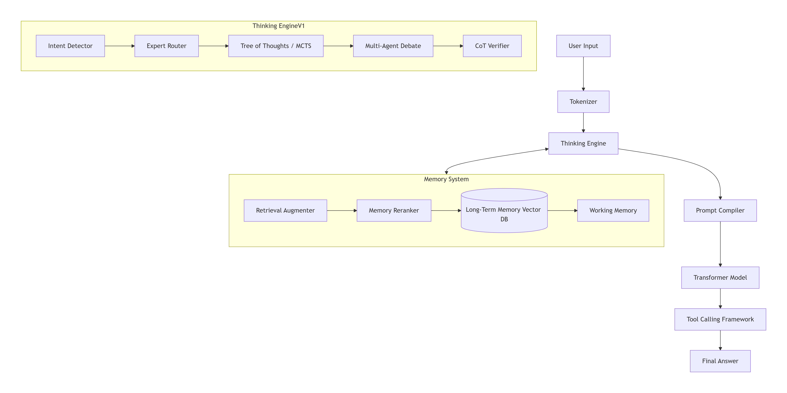

<p align="center">
  
</p>

---
# Draco AI V1 🐉
*The Next-Generation MoE Reasoning Framework — Built for Deep Engineering & Empathy*

**Draco AI V1** is a fully localized, high-performance Large Language Model based on **Qwen 3.5 9B**.  
It transforms a dense 9B checkpoint into an 8‑expert Mixture‑of‑Experts architecture, combined with a rich reasoning engine, advanced memory, and personalization.  
The project is a complete AI **framework** – not just a model – meticulously optimized for difficult tasks like deep bug fixing, automation, and complex technical chat, while staying lightweight and resource‑efficient.

Developed with pride by **Draco Studio (Vietnam)**, led by **DUCNGUYEN-creator**.

> ⚠️ **Under Active Development**  
> Draco AI V1 is an ongoing technical research project. It is progressing well but remains a work‑in‑progress.  
> We are focused on building **Native Reasoning** directly into the source code rather than relying solely on prompt engineering.
>
> **🚀 Current Roadmap:**
> - [ ] Multi‑threading optimization (thread‑safety) for the Memory System.
> - [ ] Finalizing the Bayesian Belief Updater.
> - [ ] Tuning the 8‑Expert Multi‑agent Debate mechanism.
> - [ ] Improving stability, performance, security, and RAM/VRAM efficiency.
>
> **🤝 Contributions:** All ideas and code contributions are invaluable. Let’s build together on the [Draco Studio Discord](https://discord.gg/N77gagfCkn).

---

## 🧭 Design Philosophy: The "Intelligence Trinity"

Draco AI is built on the belief that true machine intelligence for engineering doesn't come from larger parameters, but from the synergy of:

* **Structured Reasoning:** Using MCTS and Multi-Agent Debate to explore logic paths beyond next-token prediction.
* **Persistent Memory:** A vector-based Long-Term Memory (LTM) that evolves with every interaction.
* **Unified Control:** A single execution pipeline that manages intent, planning, and tool-use without external overhead.

---

## ❓ Why Draco AI?

Unlike traditional agent frameworks that depend on continuous API calls and prompt‑chaining (e.g., LangChain, Llama‑Index), **Draco AI integrates reasoning logic directly into the model’s inference loop**. This design eliminates the latency and hallucinations introduced by external orchestrators.

- **Native Reasoning Engine** – Tree‑of‑Thoughts, MCTS, Multi‑Agent Debate, and Counterfactual analysis run *inside* the model’s own pipeline, not as separate Python scripts. **Fully inspectable and debuggable.**
- **Unified Memory** – A single vector database serves both short‑term context and long‑term facts, all accessible at inference time.
- **Unified Execution Pipeline** – From intent detection to final answer, the entire pipeline is exposed via a single `process()` call. No complex multi‑step chains.
- **Resource‑Aware** – Pure NumPy inference supports CPU deployment, while PyTorch LoRA fine‑tuning runs on consumer GPUs (RTX 3060/4060).

---

---

## ⚡ Showcase: Solving the "Hard" Stuff

### Case 1: Deep Concurrency Debugging (Deadlock)

**User Query:** > *"Explain the deadlock in this Go code where two goroutines wait for each other using unbuffered channels."*

**Draco Engine Trace:**
1.  **`[MCTS Path 1]`** Goroutine A blocks on `ch1 <- val`. Goroutine B blocks on `ch2 <- val`.
2.  **`[Abduction]`** No consumer exists for `ch1` before `ch2` is sent.
3.  **`[Critique]`** Consensus reached: Circular dependency on unbuffered channels.

**Draco AI Output:**
> "The deadlock is a **Circular Wait**. Goroutine A cannot proceed to read `ch2` because it's stuck sending to `ch1`, while Goroutine B is stuck sending to `ch2`.
> 
> **Fix:** Use a `select` statement or buffered channels to break the synchronous block."

---

### Case 2: System Architecture Trade-offs

**User Query:** > *"Should I use PostgreSQL or MongoDB for a real-time analytics dashboard with 10k writes/sec?"*

**Draco AI Output:**
> "Based on your **`[Memory: Previous project context]`**, you prioritize ACID compliance for financial logs. However, for 10k writes/sec:
> 
> * **PostgreSQL:** Better for complex joins but requires partitioning (Citus) at this scale.
> * **MongoDB:** Higher write throughput but watch for memory overhead on large indexes.
> 
> **Recommendation:** Given your existing stack, stick with **PostgreSQL + TimescaleDB** extension."

---

## 💡 Use Cases

- **🔧 Deep Bug Fixing** – Analyze multi‑threaded race conditions, memory leaks, and logic errors.
- **🧠 Complex Reasoning** – Solve math, logic, and system design problems with step‑by‑step chains.
- **⚙️ Automation** – Execute tool‑calling pipelines for code generation, web search, and computation.
- **💬 Personalized Technical Chat** – Maintain long‑term memory, user profiles, and conversational context.
- **🏗️ System Design** – Evaluate architectural trade‑offs using Knowledge Graph and analogical reasoning.

---

## 🧠 How to Train Draco AI V1 (Your Own Instance)

Draco AI is designed as a **MoE‑ified dense model** – it starts from a Qwen 3.5 9B checkpoint and restructures the FFN layers into 8 experts via weight averaging.  
This means **you do not need to train from scratch**, saving enormous amounts of money and time.

> 💡 **Hardware Note:** You can fine-tune Draco’s LoRA adapters on a single consumer GPU with 12 GB VRAM or more (e.g., NVIDIA RTX 3060, RTX 4060) using QLoRA. Full model fine-tuning requires significantly more VRAM but is rarely necessary thanks to the efficient MoE architecture.

**To train your own Draco model:**

1.  **Map the Qwen 3.5 9B weights** Use the provided `load_external_weights()` method in `transformer_v1.py` to automatically distribute Qwen’s 36 dense FFN layers into the 8 experts (by layer index modulo 8, with averaging). This gives you a fully initialized MoE model instantly.

2.  **Continue training with pure text data** After weight mapping, fine‑tune the entire model (especially the router and experts) on your own text corpus. Draco already integrates **LoRA** (Low‑Rank Adaptation) for efficient fine‑tuning – chỉ cần gọi `enable_lora()` trên PyTorch model để đóng băng base weights và chỉ huấn luyện các adapter nhỏ.

3.  **Sync back to inference** Sau khi huấn luyện, `_full_sync()` sẽ sao chép toàn bộ trọng số (bao gồm cả LoRA đã được merge) sang NumPy inference engine để triển khai tốc độ cao trên CPU hoặc NumPy-accelerated.

---

---

## ⚡ Quick Start (Conceptual Preview)

*Note: The framework is under active development. This code illustrates the intended final API and high‑level usage pattern.*

```python
import json
from engine_v1 import ThinkingEngineV1
from memory_v1 import LongTermMemoryV1
from transformer_v1 import DracoTransformerV1
from tokenizer import BPETokenizer

# ------------------------------------------------------------------
# 1. Prepare the Tokenizer
# ------------------------------------------------------------------
tokenizer = BPETokenizer()
# Option A: Load a Qwen-compatible vocab (Recommended)
# tokenizer.load_from_json("qwen_tokenizer.json")
# Option B: Quick test mode — uses base byte-vocab (0-255) automatically.

# ------------------------------------------------------------------
# 2. Initialize the Memory System (Vector DB) — optional
# ------------------------------------------------------------------
# The directory is created automatically if it doesn't exist.
memory = LongTermMemoryV1(memory_dir="storage/draco_memory")

# ------------------------------------------------------------------
# 3. Initialize the Thinking Engine (The "Brain")
# ------------------------------------------------------------------
# max_experts: Controls the council size (4 is safe; 8 for full power).
# The engine uses memory via the process() arguments, not the constructor.
engine = ThinkingEngineV1(max_experts=4)

# ------------------------------------------------------------------
# 4. Load the MoE Transformer Model
# ------------------------------------------------------------------
# Option A: Load a Draco checkpoint (pre-converted Qwen 3.5 9B weights)
# model = DracoTransformerV1.load_weights("checkpoints/draco_v1_9b/")

# Option B: Smoke test with a tiny random configuration (fast execution)
config = {
    "d_model": 128, "n_layers": 2, "n_heads": 4, "n_kv_heads": 2,
    "head_dim": 32, "d_ff": 256, "n_experts": 8, "vocab_size": 151936,
    "window": 1024
}
model = DracoTransformerV1(config)

# ------------------------------------------------------------------
# 5. Run a Native Reasoning Cycle
# ------------------------------------------------------------------
query = "Analyze the logic error in this multi-threaded code..."

# Step A: Engine processes the query (Intent detection, MCTS, Debate, …)
# It can work standalone; optionally feed memory with memory_summary, ltm_facts, etc.
engine_out = engine.process(query)

# Step B: Encode the compiled ChatML prompt into Token IDs
prompt_ids = tokenizer.encode_chat(
    engine_out["messages"],
    add_generation_prompt=True
)

# Step C: Build generation parameters (Temperature, Mirostat Tau, Expert Boost)
gen_kwargs = engine.to_generate_kwargs(
    engine_out,
    identity_token_ids=[tokenizer.encode("DracoAI")[0]]  # optional identity bias
)

# Step D: Inference via the pure‑NumPy engine
response_ids = model.generate(prompt_ids, **gen_kwargs)

# ------------------------------------------------------------------
# 6. Output the Result
# ------------------------------------------------------------------
print(f"Draco AI Output: {tokenizer.decode(response_ids)}")
```
🧪 API Status: The interfaces above match the current v1 codebase. If you want to involve the Memory system, call memory.prepare_engine_input(query, intent) first and pass the returned dict to engine.process(…, memory_summary=…, …). The engine is designed to operate with or without memory.

🧩 Architectural Note: Draco Engine follows a loose coupling design. It operates independently of the Memory System by default. Contextual data (summary, facts, candidates) are injected via the process() method only when needed, allowing the engine to remain lightweight and stateless.

---

🗺️ Architecture Overview
The diagram below shows how the main modules interact during a single reasoning cycle.
(If the Mermaid diagram doesn’t render on your device, a static PNG version is available at
<p align="center">
  
</p>

---

## 🔧 Technical Architecture & Logic

The system is split into five tightly integrated modules, each containing state‑of‑the‑art algorithms and custom engineering.

### 1. Core Transformer (Inference) — `transformer_v1.py`

| Logic | Description |
| :--- | :--- |
| **RoPE Encoding** | Rotary Position Embeddings (base=10000) with precise offset tracking across long prefill and speculative decode steps. |
| **KVCache (SWA‑Sink)** | Sliding window cache that keeps initial sink tokens and recent tokens in a circular buffer; supports atomic snapshot/restore for transactional speculative decoding. |
| **Grouped Query Attention (GQA)** | Multi‑head attention with grouped KV heads, repeated via vectorized broadcast, causal masking, and clipped scores for stability. |
| **Expert FFN (SwiGLU)** | Single expert feed‑forward with SiLU activation, bias‑free, optimized for numerical stability. |
| **Mixture of Experts (MoE)** | 8 experts with top‑2 routing; Gumbel noise injection to prevent collapse; load‑balance auxiliary loss; vectorized Boolean mask dispatch. |
| **Multi‑Token Prediction Head (MTP)** | Predicts both next token (l1) and speculative token (l2) using tied `lm_head` – enables efficient speculative decoding. |
| **Transformer Block** | RMSNorm → GQA → residual → RMSNorm → MoE → residual. |
| **Generation & Sampling** | Full autoregressive loop with Mirostat v2 / top‑k‑top‑p‑min‑p sampling, distance‑decayed repetition penalty, adaptive temperature, and validated speculative decode with cache rollback. |
| **Weight Loading** | Automatically maps Qwen layer FFN weights into averaged expert weights (layer_idx % 8). |
| **Identity Overlay** | Logit‑level bias to reinforce the “Draco AI” identity without prompt rewrites. |

### 2. Training & Fine‑Tuning — `transformer_torch_v1.py`

| Logic | Description |
| :--- | :--- |
| **LoRA Adapter** | `LoRALinear` wraps attention projections with low‑rank `A`/`B` matrices for parameter‑efficient fine‑tuning. |
| **Flash Attention** | Uses `scaled_dot_product_attention` with correct causal mask and RoPE offset. |
| **Full Sync** | `_full_sync` copies all weights to the NumPy inference model with shape validation; merges LoRA on the fly. |
| **LoRA Enable / Merge** | Freeze base weights, insert LoRA layers; after training, `merge_lora()` folds adapters back for seamless export. |
| **Checkpoint I/O** | Saves config + state dict; loads with compatibility check and sorts by modification time. |
| **Training Step Helper** | `train_step` combines AMP, gradient clipping, and NaN‑loss guard. |

### 3. Tokenizer — `tokenizer.py`

| Logic | Description |
| :--- | :--- |
| **Unicode Normalization** | NFC normalization unifies accented Vietnamese characters (e.g., “hòa” vs “hoà”). |
| **Special Token Protection** | Regex splits text on special tokens (`<|im_start|>`, etc.) before BPE, preventing corruption. |
| **Pre‑Tokenization** | Word‑piece pattern segments into alpha runs, numbers, whitespace, and punctuation (mirrors Qwen’s pre‑tokenizer). |
| **BPE Encoding** | O(N log N) min‑heap merge with deterministic tie‑breaking. |
| **ChatML Template** | `encode_chat` produces `<|im_start|>role\ncontent<|im_end|>` sequences with cached newline tokens. |
| **Streaming Decode** | Yields decoded chunks as tokens arrive, accumulating incomplete UTF‑8 and flushing on word boundaries. |
| **Extension Vocab** | Supports adding custom tokens beyond the Qwen base vocabulary. |

### 4. Thinking Engine — `engine_v1.py`

| Logic | Description |
| :--- | :--- |
| **Knowledge Graph** | Weighted undirected graph with BFS, DFS, A*, triple extraction, and default AI‑domain edges. |
| **Temporal KG** | Extends KG with `valid_from` / `valid_to` attributes for time‑sensitive facts. |
| **Intent Detection** | Weighted keyword scoring detects math, code, chat, etc.; extracts entities, language, sentiment, and creativity. |
| **Expert Routing** | Maps intent to a normalized 8‑expert boost vector and sets Mirostat target entropy. |
| **Load Balancer** | Tracks expert usage and performance; adds soft equity bonus to prevent starvation. |
| **Context Window Manager** | Summarizes or trims long conversation histories to stay within token budget. |
| **Fact Consistency Checker** | Cross‑checks generated triples against KG to flag contradictions. |
| **Confidence Calibrator** | Online Platt scaling to calibrate raw confidence from feedback. |
| **Self‑Evolving Router** | Thompson Sampling updates per‑intent expert scores based on user feedback. |
| **Memory Reranker** | Rescores memory candidates by semantic similarity, intent keywords, and recency. |
| **Forgetting Mechanism** | Simulates spaced repetition and importance decay over time. |
| **User Profile Manager** | Stores and applies per‑user preferences (tone, language, creativity). |
| **Tree of Thoughts (ToT)** | MCTS‑based branching and selection for different reasoning strategies. |
| **Self‑Reflection & Critique** | Evaluates answers for hallucinations, repeats, missing facts; provides a refinement prompt. |
| **Ethical Filter** | Scores content for safety and bias; can trigger a rewrite instruction. |
| **Abduction Engine** | Hypothesises causes for “why” questions using KG and MCTS. |
| **Metaphor Detector** | Identifies figurative language and returns a literal meaning hint. |
| **Instruction Chain Parser** | Splits “first … then …” style instructions into ordered steps. |
| **Spatial Solver** | Derives relative positions from directional language (north, left, above, …). |
| **Bayesian Belief Updater** | Updates KG edge belief using Bayesian inference when new evidence arrives. |
| **Multi‑Turn Intent Tracker** | Detects topic shifts via sliding window of past intents and lexical overlap. |
| **Hypothesis Tester** | Qualitatively tests a hypothesis against KG edge weights. |
| **Tool Crafter** | Generates ad‑hoc Python code when no existing tool matches a request. |
| **Goal Decomposer** | Breaks a complex goal into sub‑goals using deep MCTS (rollout depth 20). |
| **Multi‑Agent Debate** | 2‑expert or full 8‑expert council debate with consensus detection and arbitration. |
| **Self‑Consistency** | Multiple reasoning paths (with shuffled branches) and majority voting. |
| **Dual‑Process Decider** | Routes simple queries (System 1) and complex ones (System 2). |
| **Difficulty Scorer** | Assigns a 0‑1 score to automatically escalate to slow/council reasoning. |
| **Safe AST Evaluator** | Evaluates math expressions securely via Python’s AST with node and exponent limits (DoS‑safe). |
| **Tool Calling Framework** | Injects available tools, parses `<tool_call>` blocks (with markdown fence stripping), executes them, and formats results for the LLM‑tool‑LLM loop. |
| **Chain‑of‑Thought Verifier** | Checks reasoning steps for contradictions, missing causality, circular reasoning, negation‑flip. |
| **Counterfactual Reasoner** | Adds “what‑if” branches for logic/legal questions. |
| **Analogical Mapper** | Finds structural analogies (A:B :: C:?) via KG similarity. |
| **Retrieval Augmenter (RAG)** | Hook for document retrieval; plugs into the memory pipeline. |
| **Prompt Compiler** | Assembles the final system prompt with thought plan, memory, debate, and verification results. |
| **Transformer Bridge** | Converts engine output (expert boost, tau, creativity) into the exact `generate()` kwargs for the inference model. |
| **Parallel Orchestration** | `process()` runs heavy tasks (KG extraction, ToT, debate, goal decomposition) in a `ThreadPoolExecutor` while handling lighter tasks on the main thread. |

### 5. Memory System — `memory_v1.py`

| Logic | Description |
| :--- | :--- |
| **MiniEmbedder (TF‑IDF + Hash Trick)** | 1024‑dim bag‑of‑words embedder with double hashing, entity boosting, and L2 normalization. |
| **KVCache Buffer** | Short‑term recency window with a unified learnable filter; flushes to LTM when full. |
| **Long‑Term Memory (LTM)** | Stores up to 50k vectors with semantic dedup, LRU cleanup (weighted by type and feedback), and duplicate consolidation using similarity + Jaccard. |
| **Search & MMR** | Cosine similarity search with MMR re‑ranking for diversity; search cache with version invalidation. |
| **Fact Store** | Key‑value facts with version history and confidence tracking. |
| **Working Memory** | Conversation message queue with token cap and hard message limit; automatically archives to LTM. |
| **Atomic Persistence** | Writes vectors atomically (tmp + os.replace); background daemon thread flushes every 30s. |
| **Thread Safety** | All public methods are guarded by `threading.Lock`; search snapshots data under lock. |

---

## 📂 Project Structure

| File | Role |
| :--- | :--- |
| `transformer_v1.py` | NumPy inference engine (MoE Transformer, GQA, speculative decoding, Mirostat). |
| `transformer_torch_v1.py` | PyTorch training model (Flash Attention, LoRA, full sync to NumPy). |
| `tokenizer.py` | Qwen‑compatible BPE tokenizer with Vietnamese support and streaming decode. |
| `engine_v1.py` | Reasoning orchestrator (intent detection, debate, planning, tool use, critique). |
| `memory_v1.py` | Vector memory system (embedding, retrieval, forgetting, fact storage). |

---

## ⚙️ Installation

```bash
pip install numpy
pip install torch torchvision torchaudio
```
---

## 🤝 Community & Contribution

We believe in the power of open-source and community-driven AI. **Draco AI V1** is a product of **Draco Studio (Vietnam)**. We welcome all developers, researchers, and AI enthusiasts to contribute!

* **Lead Developer:** DUCNGUYEN-creator
* **💬 Discord Community:** [Join Draco Studio Discord](https://discord.gg/N77gagfCkn)

---

## ☕ Support the Project

Draco AI V1 is an open‑source passion project.  
Training and running experiments on GPU cloud instances is expensive. If you find this work valuable, please consider **buying me a coffee** ☕ to help cover compute costs and keep development active.

Every contribution, no matter how small, directly fuels model improvements, more training, and faster releases.

[](https://www.buymeacoffee.com/DUCNGUYEN.creator)

---

## 📄 License

This project is licensed under the **Apache License 2.0**.  
Copyright 2026 **The Draco Studio** and **DUCNGUYEN-creator**.

---
*Built with ❤️ in Vietnam by Draco Studio.*